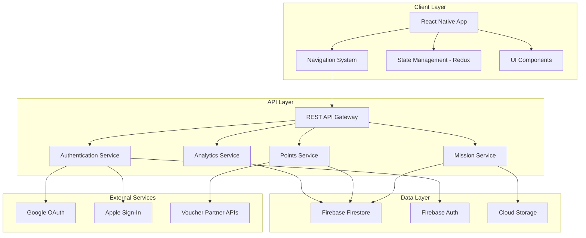

# Design Document

## Overview

KindWorld is a React Native mobile application that creates a gamified platform for social impact. The design follows a minimalist, modern aesthetic inspired by iOS Human Interface Guidelines, emphasizing clean layouts, intuitive navigation, and delightful micro-interactions. The application architecture supports three user types (regular users, company sponsors, and administrators) while maintaining a unified, elegant interface.

The technical stack leverages React Native for cross-platform development, with Firebase for backend services, and integrates with third-party OAuth providers for seamless authentication. The design prioritizes performance, accessibility, and scalability to support growing user engagement.

## Architecture

### High-Level Architecture



### Technology Stack

- **Frontend Framework**: React Native 0.72+
- **Navigation**: React Navigation 6.x
- **State Management**: Redux Toolkit with RTK Query
- **Backend**: Firebase (Firestore, Authentication, Cloud Functions, Storage)
- **UI Library**: React Native Paper (customized for brand)
- **Charts**: Victory Native for data visualization
- **Authentication**: Firebase Auth with Google OAuth and Apple Sign-In
- **Testing**: Jest, React Native Testing Library
- **Code Quality**: ESLint, Prettier, TypeScript

### Design Principles

1. **Minimalism**: Clean interfaces with purposeful white space
2. **Clarity**: Clear visual hierarchy and intuitive information architecture
3. **Consistency**: Unified design language across all screens
4. **Performance**: Optimized rendering and data fetching (< 2s load times)
5. **Accessibility**: WCAG 2.1 AA compliance with screen reader support

## Components and Interfaces

### Screen Components

#### 1. Welcome / Sign-In Screen

**Purpose**: First touchpoint for user authentication

**Visual Design**:
- Centered KindWorld logo and app name
- Large, clear heading: "Create an account"
- Subtitle: "Enter your email to sign up for this app"
- Email input field with placeholder
- Primary CTA button (black background, white text): "Continue"
- Divider with "or" text
- Two secondary buttons with brand logos:
  - "Continue with Google" (Google logo)
  - "Continue with Apple" (Apple logo)
- Footer text with Terms of Service and Privacy Policy links

**Component Structure**:
```typescript
interface SignInScreenProps {
  onEmailSignIn: (email: string) => Promise<void>;
  onGoogleSignIn: () => Promise<void>;
  onAppleSignIn: () => Promise<void>;
}

const SignInScreen: React.FC<SignInScreenProps>
```

**Key Features**:
- Input validation for email format
- Loading states during authentication
- Error handling with inline messages
- Keyboard-aware scroll view
- Auto-focus on email input

**Requirements Addressed**: 1.1, 1.2, 1.3, 1.4, 1.5, 8.1, 8.2, 8.3, 8.4, 8.5

---

#### 2. Home Dashboard Screen

**Purpose**: Central hub displaying user progress and quick actions

**Visual Design**:
- Top bar: Hamburger menu (left), "KindWorld" title (center), profile avatar (right)
- Month selector pills: "Sept 2025", "Aug 2025", "July 2025"
- Points card:
  - Large number display: "28760"
  - Label: "Points"
  - Growth indicator: "+20% month over month"
  - CTA link: "Exchange Now!"
- Points Statement chart:
  - Line graph showing points growth over 30 days
  - Y-axis: point values
  - X-axis: dates
  - Blue gradient line with smooth curves
- Leaderboard section:
  - Title: "Leaderboard"
  - List of top users with avatar, name, and points
  - Ranking indicated by position
- Bottom navigation bar (4 icons): Home, Search, Activity, Profile

**Component Structure**:
```typescript
interface DashboardScreenProps {
  user: User;
  pointsData: PointsHistory[];
  leaderboard: LeaderboardEntry[];
  selectedMonth: string;
  onMonthChange: (month: string) => void;
}

const DashboardScreen: React.FC<DashboardScreenProps>
```

**Key Features**:
- Real-time points updates
- Interactive chart with touch gestures
- Pull-to-refresh functionality
- Smooth scrolling with optimized rendering
- Skeleton loading states

**Requirements Addressed**: 2.1, 2.2, 2.3, 2.4, 2.5, 8.1, 8.2, 8.3, 8.4, 8.5

---

#### 3. Event Feed Screen

**Purpose**: Browse and discover available missions

**Visual Design**:
- Top bar: Back button (left), "Events" title (center)
- Search bar with location: "Taipei City" and edit icon
- Filter and Sort buttons with result count: "99 results"
- Section header: "Ongoing Events"
- Mission cards (scrollable):
  - Hero image with soft rounded corners
  - Date in large typography (e.g., "10月20日")
  - Mission title below date
  - Pagination dots for image carousel
  - Card shadow for depth
- Bottom navigation bar

**Component Structure**:
```typescript
interface EventFeedScreenProps {
  missions: Mission[];
  location: string;
  filters: FilterOptions;
  sortBy: SortOption;
  onFilterChange: (filters: FilterOptions) => void;
  onSortChange: (sort: SortOption) => void;
  onMissionSelect: (missionId: string) => void;
}

const EventFeedScreen: React.FC<EventFeedScreenProps>
```

**Key Features**:
- Infinite scroll with pagination
- Filter modal with multiple criteria
- Sort options (date, relevance, distance)
- Location-based mission discovery
- Image lazy loading
- Mission detail navigation

**Requirements Addressed**: 3.1, 3.2, 3.3, 3.4, 3.5, 8.1, 8.2, 8.3, 8.4, 8.5

---

#### 4. Voucher Store Screen

**Purpose**: Redeem Compassion Points for rewards

**Visual Design**:
- Top section:
  - Search bar
  - Quick links: Profile, Activity History, Friends
  - Secondary links: Orders, Points, Leaderboard
  - "Events" navigation link
- Featured event card with hero image
- "Donate now!" CTA
- Circular category icons (horizontal scroll)
- Section: "Exchange your Points for Vouchers"
- Voucher cards (grid layout):
  - Brand image/pattern
  - Brand name
  - Voucher type (e.g., "PX Mart Voucher")
  - Point cost (e.g., "NTD 100")
- Bottom navigation bar

**Component Structure**:
```typescript
interface VoucherStoreScreenProps {
  vouchers: Voucher[];
  userPoints: number;
  categories: Category[];
  onVoucherRedeem: (voucherId: string) => Promise<void>;
}

const VoucherStoreScreen: React.FC<VoucherStoreScreenProps>
```

**Key Features**:
- Point balance display
- Voucher filtering by category
- Redemption confirmation modal
- Insufficient points handling
- Redemption history
- Partner brand integration

**Requirements Addressed**: 4.1, 4.2, 4.3, 4.4, 4.5, 8.1, 8.2, 8.3, 8.4, 8.5

---

#### 5. Profile Screen

**Purpose**: Display user achievements and personal information

**Visual Design**:
- Top bar: Hamburger menu (left), "KindWorld" title (center)
- Profile card:
  - User name: "Kelley Foster"
  - Bio: "Passionate about....."
  - Points: "28760 points"
  - Social stats: "3891 followers, 201 following"
  - "Edit Profile" link
  - Profile photo (circular, right-aligned)
- Badges card:
  - Title: "Your Badges"
  - Achievement text: "Completed 892 hours of volunteering"
- Leaderboard section:
  - Title: "Leaderboard"
  - List of users with avatars, names, and points/emails
- Bottom navigation bar

**Component Structure**:
```typescript
interface ProfileScreenProps {
  user: User;
  badges: Badge[];
  stats: UserStats;
  leaderboard: LeaderboardEntry[];
  onEditProfile: () => void;
}

const ProfileScreen: React.FC<ProfileScreenProps>
```

**Key Features**:
- Profile editing capability
- Badge showcase with unlock criteria
- Social following system
- Activity history
- Settings access

**Requirements Addressed**: 5.1, 5.2, 5.3, 5.4, 5.5, 8.1, 8.2, 8.3, 8.4, 8.5

---

#### 6. CSR Analytics Dashboard (Company View)

**Purpose**: Provide sponsors with mission impact metrics

**Visual Design**:
- Header: Company logo and name
- Key metrics cards:
  - Total participants
  - Points distributed
  - Missions sponsored
  - Impact score
- Charts section:
  - Participation over time (line chart)
  - Mission categories (pie chart)
  - Geographic distribution (map view)
- Mission performance table
- Export data button

**Component Structure**:
```typescript
interface CSRDashboardProps {
  companyId: string;
  metrics: CSRMetrics;
  missions: SponsoredMission[];
  dateRange: DateRange;
  onDateRangeChange: (range: DateRange) => void;
  onExportData: () => void;
}

const CSRDashboard: React.FC<CSRDashboardProps>
```

**Key Features**:
- Real-time analytics updates
- Date range filtering
- Data export (CSV, PDF)
- Mission drill-down
- Comparative analysis

**Requirements Addressed**: 6.1, 6.2, 6.3, 6.4, 6.5, 8.2, 8.3, 8.5

---

#### 7. Admin Mission Management Screen

**Purpose**: Create and manage missions for Tzu Chi administrators

**Visual Design**:
- Mission list with status indicators
- "Create Mission" FAB button
- Mission creation form:
  - Title input
  - Description textarea
  - Date/time picker
  - Location selector
  - Points reward input
  - Image upload
  - Category selection
- Mission analytics per event
- Participant management

**Component Structure**:
```typescript
interface AdminMissionScreenProps {
  missions: Mission[];
  onCreateMission: (mission: MissionInput) => Promise<void>;
  onUpdateMission: (id: string, updates: Partial<Mission>) => Promise<void>;
  onDeleteMission: (id: string) => Promise<void>;
}

const AdminMissionScreen: React.FC<AdminMissionScreenProps>
```

**Key Features**:
- Mission CRUD operations
- Participant tracking
- Mission status management
- Bulk operations
- Engagement reports

**Requirements Addressed**: 7.1, 7.2, 7.3, 7.4, 7.5, 8.2, 8.3, 8.5

---

### Shared Components

#### Navigation Bar
```typescript
interface BottomNavProps {
  activeRoute: string;
  onNavigate: (route: string) => void;
}

const BottomNav: React.FC<BottomNavProps>
```

**Features**:
- 4 main tabs: Home, Search, Activity, Profile
- Active state indication
- Smooth transitions
- Badge notifications

#### Mission Card
```typescript
interface MissionCardProps {
  mission: Mission;
  onPress: () => void;
}

const MissionCard: React.FC<MissionCardProps>
```

**Features**:
- Image carousel
- Date display
- Title and description
- Points reward badge
- Favorite toggle

#### Points Display
```typescript
interface PointsDisplayProps {
  points: number;
  size: 'small' | 'medium' | 'large';
  showGrowth?: boolean;
  growthPercentage?: number;
}

const PointsDisplay: React.FC<PointsDisplayProps>
```

**Features**:
- Animated number transitions
- Growth indicators
- Responsive sizing

## Data Models

### User Model
```typescript
interface User {
  id: string;
  email: string;
  displayName: string;
  photoURL?: string;
  bio?: string;
  compassionPoints: number;
  totalVolunteerHours: number;
  badges: Badge[];
  followers: string[]; // User IDs
  following: string[]; // User IDs
  role: 'user' | 'company' | 'admin';
  createdAt: Timestamp;
  updatedAt: Timestamp;
}
```

### Mission Model
```typescript
interface Mission {
  id: string;
  title: string;
  description: string;
  imageUrls: string[];
  date: Timestamp;
  location: {
    address: string;
    city: string;
    coordinates: GeoPoint;
  };
  pointsReward: number;
  category: MissionCategory;
  sponsorId?: string; // Company ID
  maxParticipants?: number;
  currentParticipants: number;
  status: 'draft' | 'published' | 'ongoing' | 'completed' | 'cancelled';
  createdBy: string; // Admin user ID
  createdAt: Timestamp;
  updatedAt: Timestamp;
}

type MissionCategory = 'volunteer' | 'donation' | 'charity' | 'blood_drive' | 'other';
```

### Points Transaction Model
```typescript
interface PointsTransaction {
  id: string;
  userId: string;
  amount: number; // Positive for earning, negative for spending
  type: 'mission_completion' | 'voucher_redemption' | 'bonus' | 'adjustment';
  relatedId?: string; // Mission ID or Voucher ID
  description: string;
  timestamp: Timestamp;
}
```

### Voucher Model
```typescript
interface Voucher {
  id: string;
  brandName: string;
  brandLogo: string;
  title: string;
  description: string;
  pointsCost: number;
  monetaryValue: number; // In NTD
  category: VoucherCategory;
  stock: number;
  expiryDate?: Timestamp;
  termsAndConditions: string;
  partnerApiEndpoint?: string;
  isActive: boolean;
}

type VoucherCategory = '7-eleven' | 'familymart' | 'px-mart' | 'other';
```

### Redemption Model
```typescript
interface Redemption {
  id: string;
  userId: string;
  voucherId: string;
  pointsSpent: number;
  redemptionCode: string;
  status: 'pending' | 'issued' | 'used' | 'expired';
  redeemedAt: Timestamp;
  usedAt?: Timestamp;
  expiresAt: Timestamp;
}
```

### Badge Model
```typescript
interface Badge {
  id: string;
  name: string;
  description: string;
  iconUrl: string;
  criteria: {
    type: 'hours' | 'missions' | 'points' | 'streak';
    threshold: number;
  };
  rarity: 'common' | 'rare' | 'epic' | 'legendary';
}
```

### Leaderboard Entry Model
```typescript
interface LeaderboardEntry {
  userId: string;
  displayName: string;
  photoURL?: string;
  compassionPoints: number;
  rank: number;
  change: number; // Position change from previous period
}
```

### Company Model
```typescript
interface Company {
  id: string;
  name: string;
  logo: string;
  description: string;
  contactEmail: string;
  sponsoredMissions: string[]; // Mission IDs
  totalPointsSponsored: number;
  csrGoals: {
    targetParticipants?: number;
    targetPoints?: number;
    targetMissions?: number;
  };
  createdAt: Timestamp;
}
```

## Error Handling

### Error Categories

1. **Authentication Errors**
   - Invalid credentials
   - OAuth failures
   - Session expiration
   - Network timeout during auth

2. **Data Fetching Errors**
   - Network unavailable
   - API timeout (> 10s)
   - Invalid response format
   - Rate limiting

3. **User Action Errors**
   - Insufficient points for redemption
   - Mission already full
   - Invalid form input
   - Permission denied

4. **System Errors**
   - Database connection failure
   - Cloud function errors
   - Storage upload failures

### Error Handling Strategy

```typescript
interface AppError {
  code: string;
  message: string;
  userMessage: string; // User-friendly message
  severity: 'info' | 'warning' | 'error' | 'critical';
  recoverable: boolean;
  retryable: boolean;
}

class ErrorHandler {
  static handle(error: AppError): void {
    // Log to analytics
    Analytics.logError(error);
    
    // Show user-friendly message
    if (error.severity === 'critical') {
      Alert.alert('Error', error.userMessage);
    } else {
      Toast.show(error.userMessage);
    }
    
    // Attempt recovery if possible
    if (error.recoverable) {
      this.attemptRecovery(error);
    }
  }
  
  static attemptRecovery(error: AppError): void {
    // Implement retry logic, cache fallback, etc.
  }
}
```

### User Feedback Patterns

- **Loading States**: Skeleton screens for initial loads, spinners for actions
- **Success Feedback**: Toast notifications with checkmark icon
- **Error Messages**: Inline validation errors, modal alerts for critical errors
- **Empty States**: Friendly illustrations with actionable CTAs
- **Offline Mode**: Banner notification with retry option

## Testing Strategy

### Unit Testing

**Scope**: Individual components, utilities, and business logic

**Tools**: Jest, React Native Testing Library

**Coverage Targets**:
- Utility functions: 90%
- Redux reducers/actions: 85%
- Business logic: 85%
- UI components: 70%

**Key Test Cases**:
- Points calculation logic
- Date formatting utilities
- Form validation functions
- Redux state mutations
- API response parsing

### Integration Testing

**Scope**: Component interactions, navigation flows, API integration

**Tools**: Jest, React Native Testing Library, MSW (Mock Service Worker)

**Key Test Scenarios**:
- Authentication flow (email, Google, Apple)
- Mission browsing and filtering
- Voucher redemption process
- Points earning and spending
- Leaderboard updates

### End-to-End Testing

**Scope**: Complete user journeys across the app

**Tools**: Detox

**Critical Paths**:
1. New user onboarding → Browse missions → Join mission → Earn points
2. Existing user → View dashboard → Redeem voucher → Confirm redemption
3. Admin → Create mission → Publish → Track participation
4. Company → View analytics → Export report

### Performance Testing

**Metrics**:
- App launch time: < 2s
- Screen transition time: < 300ms
- API response time: < 2s
- Chart rendering: < 500ms
- Image loading: Progressive with placeholders

**Tools**: React Native Performance Monitor, Flipper, Firebase Performance Monitoring

### Accessibility Testing

**Requirements**:
- Screen reader compatibility (VoiceOver, TalkBack)
- Minimum touch target size: 44x44 points
- Color contrast ratio: 4.5:1 for text
- Keyboard navigation support
- Dynamic type support

**Tools**: Accessibility Inspector, axe DevTools

### Visual Regression Testing

**Scope**: Ensure UI consistency across updates

**Tools**: Percy, Chromatic

**Coverage**: All primary screens in light/dark modes

## Design System

### Color Palette

```typescript
const colors = {
  // Primary
  primary: '#000000',      // Black for primary actions
  primaryLight: '#333333',
  
  // Secondary
  secondary: '#F5F5F5',    // Light gray backgrounds
  secondaryDark: '#E0E0E0',
  
  // Accent
  accent: '#4A90E2',       // Blue for charts and links
  accentLight: '#7AB8FF',
  
  // Semantic
  success: '#4CAF50',
  warning: '#FF9800',
  error: '#F44336',
  info: '#2196F3',
  
  // Neutrals
  white: '#FFFFFF',
  gray100: '#F9F9F9',
  gray200: '#EEEEEE',
  gray300: '#DDDDDD',
  gray400: '#BDBDBD',
  gray500: '#9E9E9E',
  gray600: '#757575',
  gray700: '#616161',
  gray800: '#424242',
  gray900: '#212121',
  black: '#000000',
  
  // Text
  textPrimary: '#000000',
  textSecondary: '#757575',
  textDisabled: '#BDBDBD',
};
```

### Typography

```typescript
const typography = {
  // Headings
  h1: {
    fontFamily: 'SF Pro Display',
    fontSize: 34,
    fontWeight: '700',
    lineHeight: 41,
  },
  h2: {
    fontFamily: 'SF Pro Display',
    fontSize: 28,
    fontWeight: '700',
    lineHeight: 34,
  },
  h3: {
    fontFamily: 'SF Pro Display',
    fontSize: 22,
    fontWeight: '600',
    lineHeight: 28,
  },
  
  // Body
  body1: {
    fontFamily: 'SF Pro Text',
    fontSize: 17,
    fontWeight: '400',
    lineHeight: 22,
  },
  body2: {
    fontFamily: 'SF Pro Text',
    fontSize: 15,
    fontWeight: '400',
    lineHeight: 20,
  },
  
  // UI Elements
  button: {
    fontFamily: 'SF Pro Text',
    fontSize: 17,
    fontWeight: '600',
    lineHeight: 22,
  },
  caption: {
    fontFamily: 'SF Pro Text',
    fontSize: 13,
    fontWeight: '400',
    lineHeight: 18,
  },
  overline: {
    fontFamily: 'SF Pro Text',
    fontSize: 11,
    fontWeight: '600',
    lineHeight: 13,
    letterSpacing: 1.5,
    textTransform: 'uppercase',
  },
};
```

### Spacing System

```typescript
const spacing = {
  xs: 4,
  sm: 8,
  md: 16,
  lg: 24,
  xl: 32,
  xxl: 48,
};
```

### Border Radius

```typescript
const borderRadius = {
  sm: 8,
  md: 12,
  lg: 16,
  xl: 24,
  round: 9999,
};
```

### Shadows

```typescript
const shadows = {
  sm: {
    shadowColor: '#000',
    shadowOffset: { width: 0, height: 1 },
    shadowOpacity: 0.05,
    shadowRadius: 2,
    elevation: 1,
  },
  md: {
    shadowColor: '#000',
    shadowOffset: { width: 0, height: 2 },
    shadowOpacity: 0.08,
    shadowRadius: 4,
    elevation: 2,
  },
  lg: {
    shadowColor: '#000',
    shadowOffset: { width: 0, height: 4 },
    shadowOpacity: 0.12,
    shadowRadius: 8,
    elevation: 4,
  },
};
```

## API Endpoints

### Authentication
- `POST /api/auth/email` - Email sign-in/sign-up
- `POST /api/auth/google` - Google OAuth
- `POST /api/auth/apple` - Apple Sign-In
- `POST /api/auth/logout` - User logout
- `GET /api/auth/session` - Verify session

### Users
- `GET /api/users/:id` - Get user profile
- `PUT /api/users/:id` - Update user profile
- `GET /api/users/:id/points` - Get points history
- `GET /api/users/:id/badges` - Get user badges
- `GET /api/users/:id/missions` - Get user's missions

### Missions
- `GET /api/missions` - List missions (with filters)
- `GET /api/missions/:id` - Get mission details
- `POST /api/missions` - Create mission (admin only)
- `PUT /api/missions/:id` - Update mission (admin only)
- `DELETE /api/missions/:id` - Delete mission (admin only)
- `POST /api/missions/:id/join` - Join a mission
- `POST /api/missions/:id/complete` - Mark mission complete

### Points
- `GET /api/points/transactions` - Get transaction history
- `POST /api/points/award` - Award points (system/admin)
- `GET /api/leaderboard` - Get leaderboard

### Vouchers
- `GET /api/vouchers` - List available vouchers
- `GET /api/vouchers/:id` - Get voucher details
- `POST /api/vouchers/:id/redeem` - Redeem voucher
- `GET /api/redemptions` - Get user's redemptions

### Analytics (Company)
- `GET /api/analytics/company/:id` - Get CSR metrics
- `GET /api/analytics/missions/:id` - Get mission analytics
- `POST /api/analytics/export` - Export data

### Admin
- `GET /api/admin/users` - List all users
- `GET /api/admin/missions` - List all missions
- `GET /api/admin/reports` - Generate reports
- `POST /api/admin/badges` - Create badges

## Security Considerations

1. **Authentication**: Firebase Auth with secure token management
2. **Authorization**: Role-based access control (RBAC)
3. **Data Validation**: Input sanitization on client and server
4. **API Security**: Rate limiting, request signing
5. **Data Privacy**: GDPR compliance, data encryption at rest
6. **Secure Storage**: Encrypted local storage for sensitive data
7. **Network Security**: HTTPS only, certificate pinning

## Performance Optimizations

1. **Code Splitting**: Lazy load screens and heavy components
2. **Image Optimization**: WebP format, responsive images, lazy loading
3. **Caching**: Redux Persist for offline support, API response caching
4. **Memoization**: React.memo, useMemo, useCallback for expensive operations
5. **List Virtualization**: FlatList with optimized rendering
6. **Bundle Size**: Tree shaking, dynamic imports
7. **Network**: Request batching, GraphQL for complex queries (future)

## Deployment Strategy

1. **Development**: Local development with Firebase emulators
2. **Staging**: TestFlight (iOS), Internal Testing (Android)
3. **Production**: App Store, Google Play Store
4. **CI/CD**: GitHub Actions for automated builds and tests
5. **Monitoring**: Firebase Crashlytics, Analytics
6. **Feature Flags**: Remote Config for gradual rollouts
